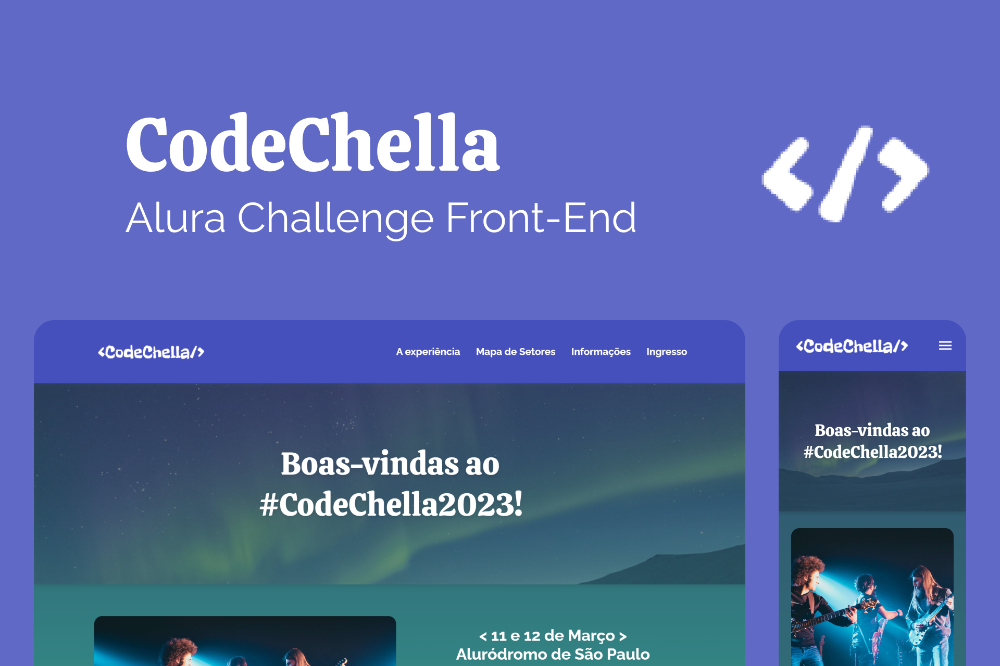

<h1 align="center">
    <br>
    
</h1>

<h4 align="center">
    Alura Challenge Front-End 🤿
</h4>

<p align="center">
    
    
    
</p>

<h1 align="center">
    
</h1>

# CodeChella 
O CodeChella é um festival de música alternativa que acontece anualmente, é composto por gêneros diversos e visa promover uma experiência encantadora e inesquecível para o visitante, proporcionando uma integração multicultural e social.

## 🛠️ Tecnologias

Esse projeto foi desenvolvido com as seguintes tecnologias:

- [Vite](https://vitejs.dev/)
- [Sass](https://sass-lang.com/install)
- [TypeScript](https://www.typescriptlang.org/)
- [React Router](https://reactrouter.com/en/main/start/tutorial)
- [React Hook Form](https://react-hook-form.com/get-started/)

## 🚀 Como executar

Clone o projeto e acesse a pasta do mesmo.

```bash
$ git clone https://github.com/pejamp/codechella-alurachallenge
$ cd codechella-alurachallenge
```

Para iniciá-lo, siga os passos abaixo:
```bash
# Instalar as dependências
$ npm install

# Iniciar o projeto
$ npm run dev
```
O app estará disponível no seu browser pelo endereço http://localhost:3000.

## 🌐 Projeto

- [Deploy](https://codechella-alurachallenge.vercel.app/)

## 👨‍💻 Autor

<a href="https://github.com/pejamp">
 
 <br />
 <sub><b>Pedro Rodrigues</b></sub>
</a> 
<a href="https://github.com/pejamp"></a>
<br />

## Contact me!

[](https://www.linkedin.com/in/pedro-rodrigues-3a3647176/)
[](mailto:pedro.roguea@gmail.com)
